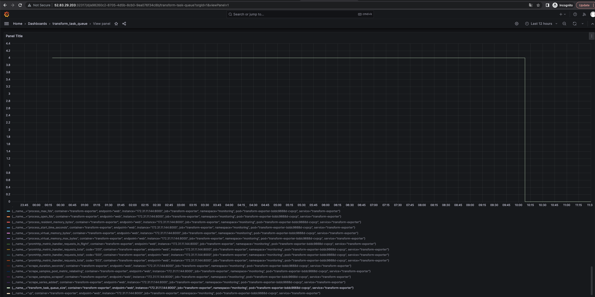

## 下载 kube-prometheus-stack 包（手动拉取 chart 包）

```
$ wget https://github.com/prometheus-community/helm-charts/releases/download/kube-prometheus-stack-47.0.0/kube-prometheus-stack-47.0.0.tgz

$ tar -zvxf kube-prometheus-stack-47.0.0.tgz
```

## 修改镜像仓库

修改 `values.yaml` 文件的镜像仓库为阿里云国内镜像仓库地址
```
...
    annotations: {}
    #   argocd.argoproj.io/hook: PreSync
    #   argocd.argoproj.io/hook-delete-policy: HookSucceeded
    patch:
      enabled: true
      image:
        # registry: registry.k8s.io
        registry: registry.aliyuncs.com
        repository: google_containers/kube-webhook-certgen
        # repository: ingress-nginx/kube-webhook-certgen
        tag: v20221220-controller-v1.5.1-58-g787ea74b6
        sha: ""
        pullPolicy: IfNotPresent
...
```

## 安装 Prometheus

```
$ kubectl create namespace monitoring

$ helm install prometheus-stack ./kube-prometheus-stack --namespace monitoring
NAME: prometheus-stack
LAST DEPLOYED: Mon Jun 26 14:15:23 2023
NAMESPACE: monitoring
STATUS: deployed
REVISION: 1
NOTES:
kube-prometheus-stack has been installed. Check its status by running:
  kubectl --namespace monitoring get pods -l "release=prometheus-stack"

Visit https://github.com/prometheus-operator/kube-prometheus for instructions on how to create & configure Alertmanager and Prometheus instances using the Operator.

$ kubectl get all -n monitoring
NAME                                                         READY   STATUS    RESTARTS   AGE
pod/alertmanager-prometheus-stack-kube-prom-alertmanager-0   2/2     Running   0          13m
pod/prometheus-prometheus-stack-kube-prom-prometheus-0       2/2     Running   0          13m
pod/prometheus-stack-grafana-fb8b8875c-2c54d                 3/3     Running   0          14m
pod/prometheus-stack-kube-prom-operator-6df4677b9b-5mm6f     1/1     Running   0          14m
pod/prometheus-stack-kube-state-metrics-65fcdddb7c-dn25z     1/1     Running   0          13s
pod/prometheus-stack-prometheus-node-exporter-dr4kc          1/1     Running   0          14m
pod/prometheus-stack-prometheus-node-exporter-v6xx8          1/1     Running   0          14m
pod/prometheus-stack-prometheus-node-exporter-zvmr9          1/1     Running   0          14m

NAME                                                TYPE        CLUSTER-IP       EXTERNAL-IP   PORT(S)                      AGE
service/alertmanager-operated                       ClusterIP   None             <none>        9093/TCP,9094/TCP,9094/UDP   13m
service/prometheus-operated                         ClusterIP   None             <none>        9090/TCP                     13m
service/prometheus-stack-grafana                    ClusterIP   10.100.175.104   <none>        80/TCP                       14m
service/prometheus-stack-kube-prom-alertmanager     ClusterIP   10.100.13.251    <none>        9093/TCP                     14m
service/prometheus-stack-kube-prom-operator         ClusterIP   10.100.226.107   <none>        443/TCP                      14m
service/prometheus-stack-kube-prom-prometheus       ClusterIP   10.100.31.172    <none>        9090/TCP                     14m
service/prometheus-stack-kube-state-metrics         ClusterIP   10.100.14.90     <none>        8080/TCP                     14m
service/prometheus-stack-prometheus-node-exporter   ClusterIP   10.100.247.50    <none>        9100/TCP                     14m

NAME                                                       DESIRED   CURRENT   READY   UP-TO-DATE   AVAILABLE   NODE SELECTOR            AGE
daemonset.apps/prometheus-stack-prometheus-node-exporter   3         3         3       3            3           kubernetes.io/os=linux   14m

NAME                                                  READY   UP-TO-DATE   AVAILABLE   AGE
deployment.apps/prometheus-stack-grafana              1/1     1            1           14m
deployment.apps/prometheus-stack-kube-prom-operator   1/1     1            1           14m
deployment.apps/prometheus-stack-kube-state-metrics   1/1     1            1           14m

NAME                                                             DESIRED   CURRENT   READY   AGE
replicaset.apps/prometheus-stack-grafana-fb8b8875c               1         1         1       14m
replicaset.apps/prometheus-stack-kube-prom-operator-6df4677b9b   1         1         1       14m
replicaset.apps/prometheus-stack-kube-state-metrics-57d96994f9   0         0         0       21s
replicaset.apps/prometheus-stack-kube-state-metrics-59699c9fc4   0         0         0       8m1s
replicaset.apps/prometheus-stack-kube-state-metrics-65fcdddb7c   1         1         1       16s
replicaset.apps/prometheus-stack-kube-state-metrics-84585c8b86   0         0         0       14m
replicaset.apps/prometheus-stack-kube-state-metrics-fb6b8dfbb    0         0         0       7m41s

NAME                                                                    READY   AGE
statefulset.apps/alertmanager-prometheus-stack-kube-prom-alertmanager   1/1     14m
statefulset.apps/prometheus-prometheus-stack-kube-prom-prometheus       1/1     14m
```

## 错误处理

```
kubectl get all -n monitoring
NAME                                                         READY   STATUS             RESTARTS   AGE
pod/alertmanager-prometheus-stack-kube-prom-alertmanager-0   2/2     Running            0          6m22s
pod/prometheus-prometheus-stack-kube-prom-prometheus-0       2/2     Running            0          6m22s
pod/prometheus-stack-grafana-fb8b8875c-2c54d                 3/3     Running            0          6m31s
pod/prometheus-stack-kube-prom-operator-6df4677b9b-5mm6f     1/1     Running            0          6m31s
pod/prometheus-stack-kube-state-metrics-59699c9fc4-q7rr2     0/1     ImagePullBackOff   0          23s
pod/prometheus-stack-kube-state-metrics-fb6b8dfbb-rsfdz      0/1     ErrImagePull       0          3s
pod/prometheus-stack-prometheus-node-exporter-dr4kc          1/1     Running            0          6m31s
pod/prometheus-stack-prometheus-node-exporter-v6xx8          1/1     Running            0          6m31s
pod/prometheus-stack-prometheus-node-exporter-zvmr9          1/1     Running            0          6m31s

NAME                                                TYPE        CLUSTER-IP       EXTERNAL-IP   PORT(S)                      AGE
service/alertmanager-operated                       ClusterIP   None             <none>        9093/TCP,9094/TCP,9094/UDP   6m23s
service/prometheus-operated                         ClusterIP   None             <none>        9090/TCP                     6m23s
service/prometheus-stack-grafana                    ClusterIP   10.100.175.104   <none>        80/TCP                       6m32s
service/prometheus-stack-kube-prom-alertmanager     ClusterIP   10.100.13.251    <none>        9093/TCP                     6m32s
service/prometheus-stack-kube-prom-operator         ClusterIP   10.100.226.107   <none>        443/TCP                      6m32s
service/prometheus-stack-kube-prom-prometheus       ClusterIP   10.100.31.172    <none>        9090/TCP                     6m32s
service/prometheus-stack-kube-state-metrics         ClusterIP   10.100.14.90     <none>        8080/TCP                     6m32s
service/prometheus-stack-prometheus-node-exporter   ClusterIP   10.100.247.50    <none>        9100/TCP                     6m32s

NAME                                                       DESIRED   CURRENT   READY   UP-TO-DATE   AVAILABLE   NODE SELECTOR            AGE
daemonset.apps/prometheus-stack-prometheus-node-exporter   3         3         3       3            3           kubernetes.io/os=linux   6m33s

NAME                                                  READY   UP-TO-DATE   AVAILABLE   AGE
deployment.apps/prometheus-stack-grafana              1/1     1            1           6m33s
deployment.apps/prometheus-stack-kube-prom-operator   1/1     1            1           6m33s
deployment.apps/prometheus-stack-kube-state-metrics   0/1     1            0           6m33s

NAME                                                             DESIRED   CURRENT   READY   AGE
replicaset.apps/prometheus-stack-grafana-fb8b8875c               1         1         1       6m34s
replicaset.apps/prometheus-stack-kube-prom-operator-6df4677b9b   1         1         1       6m34s
replicaset.apps/prometheus-stack-kube-state-metrics-59699c9fc4   1         1         0       26s
replicaset.apps/prometheus-stack-kube-state-metrics-84585c8b86   0         0         0       6m34s
replicaset.apps/prometheus-stack-kube-state-metrics-fb6b8dfbb    1         1         0       6s

NAME                                                                    READY   AGE
statefulset.apps/alertmanager-prometheus-stack-kube-prom-alertmanager   1/1     6m25s
statefulset.apps/prometheus-prometheus-stack-kube-prom-prometheus       1/1     6m25s

$ kubectl describe pod/prometheus-stack-kube-state-metrics-84585c8b86-48bxm -n monitoring
  ......
  Warning  Failed     29s (x2 over 71s)  kubelet            Error: ErrImagePull
  Warning  Failed     29s                kubelet            Failed to pull image "registry.k8s.io/kube-state-metrics/kube-state-metrics:v2.9.2": rpc error: code = Unknown desc = failed to pull and unpack image "registry.k8s.io/kube-state-metrics/kube-state-metrics:v2.9.2": failed to resolve reference "registry.k8s.io/kube-state-metrics/kube-state-metrics:v2.9.2": failed to do request: Head "https://asia-east1-docker.pkg.dev/v2/k8s-artifacts-prod/images/kube-state-metrics/kube-state-metrics/manifests/v2.9.2": dial tcp 142.251.170.82:443: i/o timeout
  Normal   BackOff    17s (x2 over 70s)  kubelet            Back-off pulling image "registry.k8s.io/kube-state-metrics/kube-state-metrics:v2.9.2"
  Warning  Failed     17s (x2 over 70s)  kubelet            Error: ImagePullBackOff
  Normal   Pulling    4s (x3 over 102s)  kubelet            Pulling image "registry.k8s.io/kube-state-metrics/kube-state-metrics:v2.9.2"
```

因为国内网络原因，`registry.k8s.io/kube-state-metrics/kube-state-metrics` 镜像拉取失败，替换为私有镜像仓库地址 `748172492803.dkr.ecr.cn-northwest-1.amazonaws.com.cn/k8s/kube-state-metrics/kube-state-metrics`。

## 修改服务的端口类型

```
$ kubectl edit service/prometheus-stack-grafana -n monitoring
```
将 `ClusterIP` 改为 `NodePort`

```
type: ClusterIP
```
修改后如下，k8s 为 grafana 分配的端口如下

```
...
service/prometheus-stack-grafana                    NodePort    10.100.175.104   <none>        80:32317/TCP                 44m
...
```

## 获取 grafana 的密码

```
$ kubectl get secret prometheus-stack-grafana -oyaml -n monitoring | grep admin-password | grep -v '{}' | awk '{print $2}' | base64 -d
```

## 查看 Prometheus 原生管理后台

```
$ kubectl --namespace=monitoring port-forward service/prometheus-stack-kube-prom-prometheus 9090
Forwarding from [::1]:9090 -> 9090
```

访问 `http://localhost:9090` 界面如下所示：


## grafana 配置 Prometheus 的数据源

部署完成默认已经配置

## 添加 Prometheus Exporter 事件


## ServiceMonitor 不生效

```
$ kubectl logs statefulset.apps/prometheus-inst -n monitoring
...
ts=2023-06-26T09:12:13.071Z caller=klog.go:116 level=error component=k8s_client_runtime func=ErrorDepth msg="pkg/mod/k8s.io/client-go@v0.26.2/tools/cache/reflector.go:169: Failed to watch *v1.Service: failed to list *v1.Service: services is forbidden: User \"system:serviceaccount:monitoring:default\" cannot list resource \"services\" in API group \"\" at the cluster scope"
```

## 创建角色

```
$ kubectl create role promethe-exporter-role --verb=list,watch,get --resource=services,pods,endpoints --namespace=monitoring

$ kubectl create rolebinding promethe-exporter-rolebinding --role=promethe-exporter-role --serviceaccount=monitoring:default --namespace=monitoring

$ kubectl create clusterrolebinding promethe-exporter-rolebinding --role=system:monitoring --serviceaccount=monitoring:default --namespace=monitoring
```

## 创建 Prometheus Exporter

执行 `yaml` 文件夹下的 `exporter.yaml`、`servicemonitor.yaml`、`prometheus-inis.yaml` 创建 Prometheus Exporter、ServiceMonitor、Prometheus实例





## 安装 Prometheus Adapter 

```
$ helm repo add prometheus-community https://prometheus-community.github.io/helm-charts
$ helm install prometheus-adapter prometheus-community/prometheus-adapter --namespace=monitoring -f adapter-values.yaml
NAME: prometheus-adapter
LAST DEPLOYED: Tue Jun 27 14:01:03 2023
NAMESPACE: monitoring
STATUS: deployed
REVISION: 1
TEST SUITE: None
NOTES:
prometheus-adapter has been deployed.
In a few minutes you should be able to list metrics using the following command(s):

  kubectl get --raw /apis/custom.metrics.k8s.io/v1beta1
```

此处可能会报权限问题，可根据具体的日志信息分析，创建对应的 `clusterrole` 和 `clusterrolebinding`。

```
kubectl create rolebinding -n kube-system prometheus-adapter-rolebinding --role=extension-apiserver-authentication-reader --serviceaccount=monitoring:prometheus-adapter
```

安装成功后，可通过如下命令获取自定义的指标信息。

```
$ kubectl get --raw "/apis/custom.metrics.k8s.io/v1beta1/namespaces/monitoring/pods/%2A/transform_task_queue_size"
{"kind":"MetricValueList","apiVersion":"custom.metrics.k8s.io/v1beta1","metadata":{},"items":[{"describedObject":{"kind":"Pod","namespace":"monitoring","name":"transform-exporter-858866d559-nsnjp","apiVersion":"/v1"},"metricName":"transform_task_queue_size","timestamp":"2023-06-27T08:04:36Z","value":"31","selector":null}]}
```

## 创建 HPA

执行 `example/worker` 目录下的 `service.yaml` 创建 `Deployment` 和 `HPA` 。

```
$ kubectl get hpa -n monitoring
NAME          REFERENCE                TARGETS   MINPODS   MAXPODS   REPLICAS   AGE
task-worker   Deployment/task-worker   55/10     1         20        3          22m
```

## 附录

- [prometheus-operator部署](https://blog.csdn.net/qq_42883074/article/details/123002118)
- [Prometheus-Operator使用ServiceMonitor监控配置时遇坑与解决总结](https://www.cnblogs.com/maxzhang1985/p/17374615.html)
- [灵活调节 HPA 扩缩容速率](https://imroc.cc/kubernetes/best-practices/autoscaling/hpa-velocity.html)
- [prometheus-community](https://github.com/prometheus-community/helm-charts)